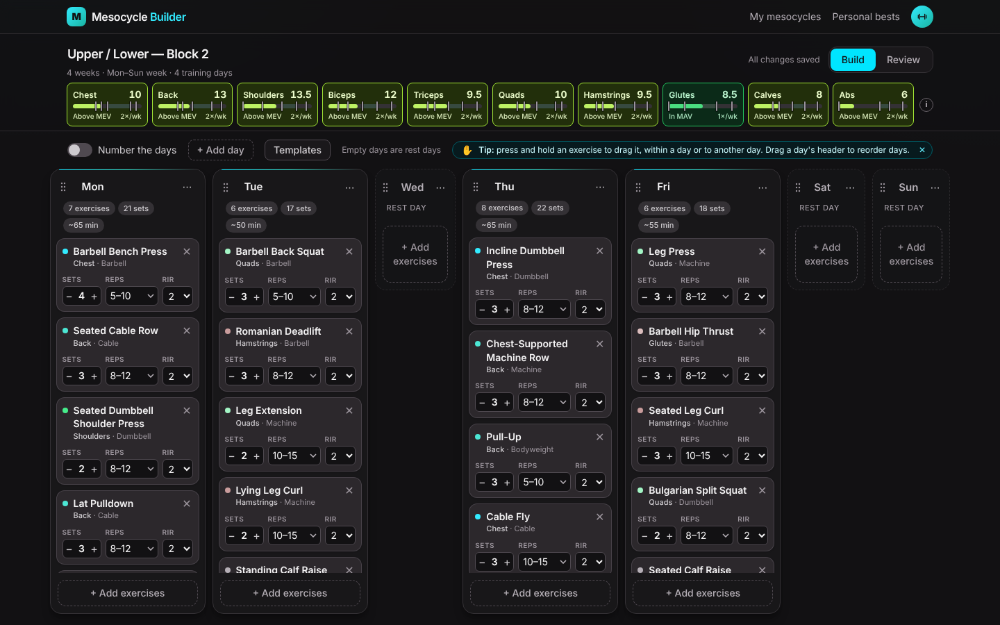
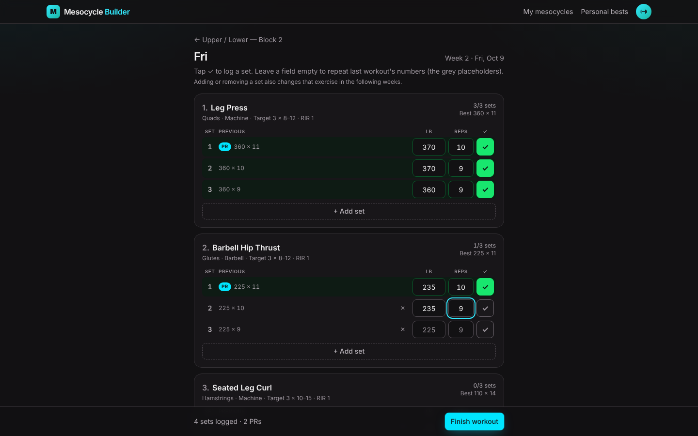
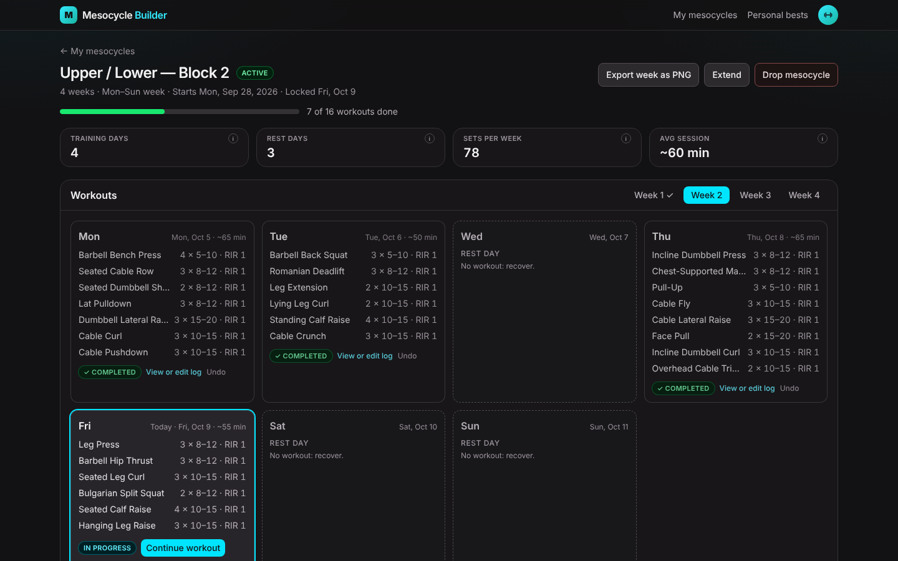
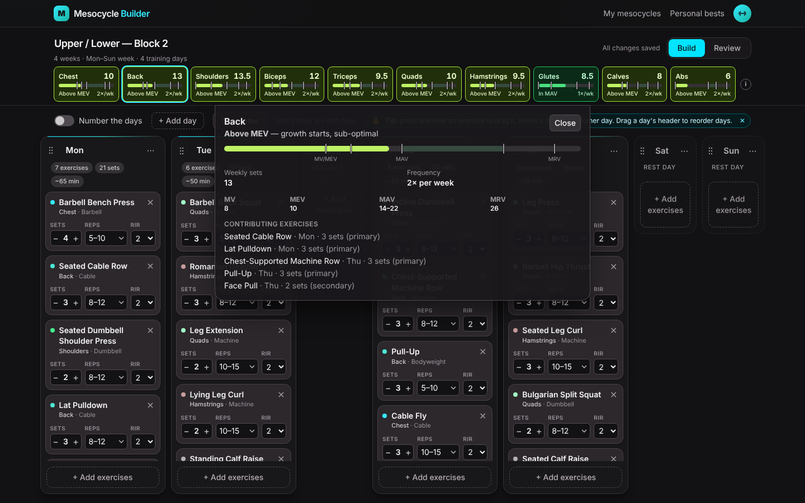
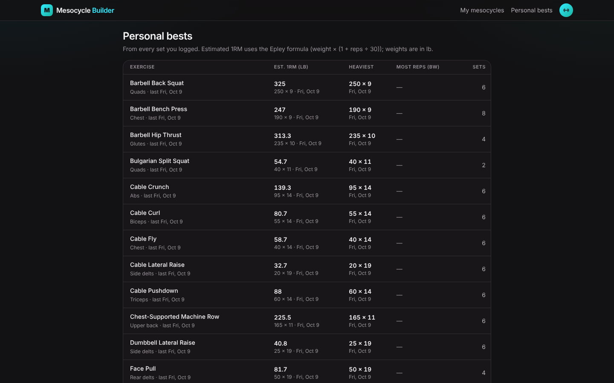
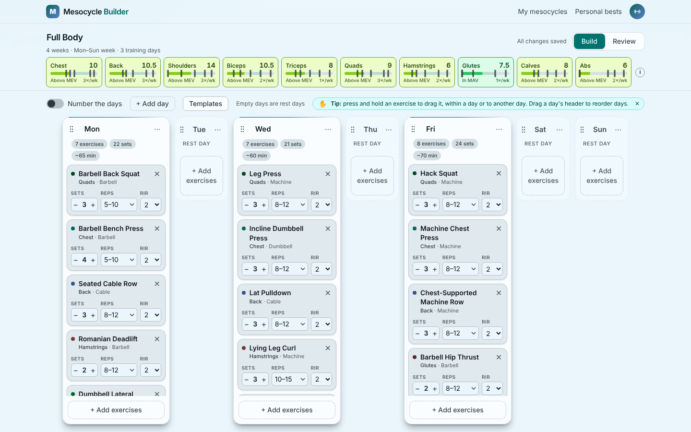
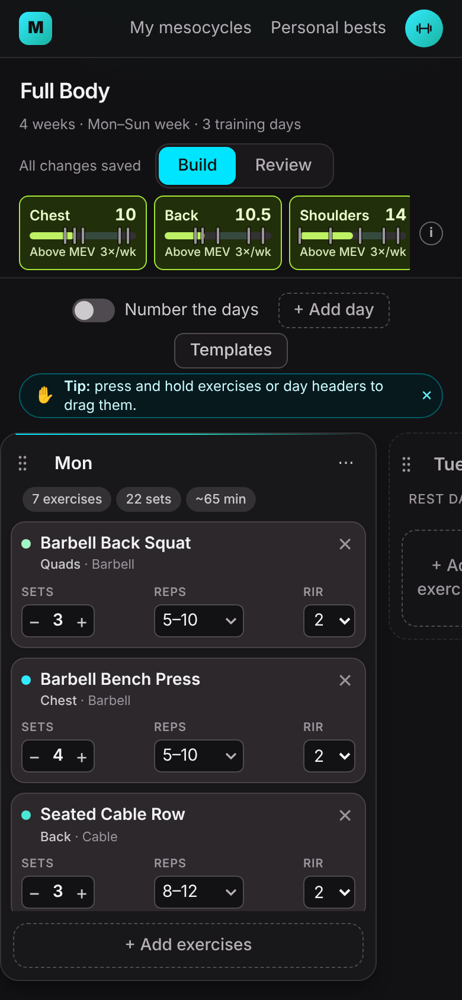
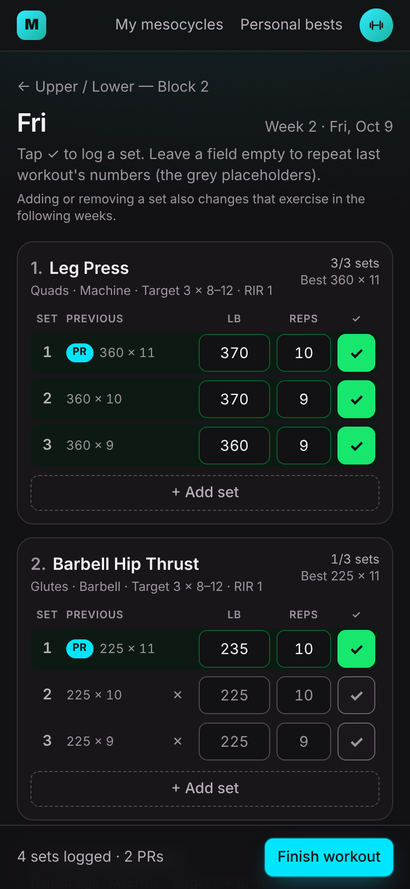
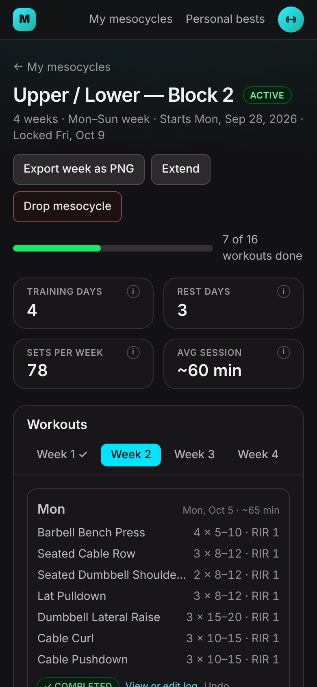

# Mesocycle Builder – Hypertrophy Training Planner

## Preview

<p align="center">
  
  
</p>

<p align="center">
  
  
</p>

<p align="center">
  
  
</p>

<p align="center">
  
  
  
</p>

More screens (login, templates, Review, lock-in, settings…) are in [`docs/screenshots`](docs/screenshots).

---

## What is Mesocycle Builder?

Mesocycle Builder is a web app for planning and running hypertrophy training blocks (mesocycles) of 3–10 weeks.
You lay out your training week on a board of day columns, and a volume bar shows live how many weekly sets each
muscle group gets compared with its landmarks (MV, MEV, MAV, MRV), so you can see at a glance whether a muscle is
under-trained, in its growth zone or past what it can recover from. Once the plan looks right you lock it in: every
week's workouts are generated with an RIR ramp and an optional deload, and you log your sets as you train.

---

## Features

**Mesocycle Builder**
  - Drag-and-drop board: one column per day, exercises as cards (touch and keyboard friendly)
  - Prebuilt templates: Full Body, Upper / Lower, Push / Pull / Legs and more
  - ~100 exercises with muscle and equipment filters, plus your own custom exercises

**Live Volume Tracking**
  - Weekly sets per muscle group, colored against MV / MEV / MAV / MRV landmarks
  - Click a muscle group to see which exercises contribute to it
  - Review screen with session length estimates and total sets for the whole block

**Lock-in and Progression**
  - Generates every week's workouts, with RIR dropping each week and an optional deload week
  - Warns you before locking in a muscle group below maintenance or above its recoverable volume
  - Extend a running mesocycle by a few weeks; export a week as a PNG

**Workout Logging**
  - Log weight and reps per set; your previous workout's numbers are the placeholders
  - Tap ✓ on an empty row to repeat last time's numbers
  - Add or remove sets on the fly; the change carries over to the following weeks
  - Warns you before finishing a workout with empty sets

**Progress Tracking**
  - PR badges when you beat your best set
  - Personal bests page: estimated 1RM, heaviest set and most bodyweight reps per exercise
  - Workouts, sets and mesocycles completed, plus an archive of finished blocks

**Accounts and Personalization**
  - Email and password or Google sign-in
  - Six color palettes, each with dark and light mode
  - Avatar icons, kg or lb, and an option to hide RIR

---

## Author

**Justin Kadyrov**  
Software Developer & Fitness Enthusiast

---

## Running it locally

Full spec: [`docs/SPEC.md`](docs/SPEC.md).

### Prerequisites

- Node.js 22+
- pnpm 9.15.4+
- PostgreSQL running locally on port 5432 (no Docker needed)

### Setup (PowerShell)

```powershell
Copy-Item .env.example .env      # then edit the passwords/database names and set AUTH_SECRET (see below)
pnpm install
pnpm db:migrate                  # creates the database if missing, applies migrations, regenerates the Prisma client
pnpm db:seed                     # dev user, muscle landmarks and ~100 exercises (safe to re-run)
pnpm dev                         # http://localhost:3000
```

`.env` values (see `.env.example`): `DATABASE_URL` (dev), `TEST_DATABASE_URL` (tests), `DEV_USER_EMAIL`, and for accounts:

- `AUTH_SECRET` (required): signs session cookies. Generate one with
  `node -e "console.log(require('crypto').randomBytes(32).toString('base64'))"`.
- `AUTH_GOOGLE_ID` and `AUTH_GOOGLE_SECRET` (optional): enable **Continue with Google**. In Google Cloud Console create an
  OAuth client (APIs & Services > Credentials > Create credentials > OAuth client ID, type *Web application*) with the
  authorized redirect URI `http://localhost:3000/api/auth/callback/google`. Leave them empty to hide the button.

Do not commit `.env`. Your mesocycles from before accounts existed belong to `DEV_USER_EMAIL`: create an account with that
email (on `/login`, Create account) to keep them.

### Using the app

Open <http://localhost:3000>. You'll be asked to sign in: **Create account** (email and password) or **Continue with Google**.
Your avatar in the header opens a small account menu: name, email, the active mesocycle's progress, **Personal bests**,
**Settings** and **Sign out**. **Settings** holds the rest: your name and avatar (pick an icon and a color), **Show RIR**
(turn it off if you don't train by RIR), the **Weight unit** (kg or lb), **Appearance** (six color palettes, each in dark
and light mode), your training stats and account details.
Each account sees only its own mesocycles.

On the list (**Current** and **Archive** tabs), drag a card by its ⠿ grip to reorder; drafts and archived mesocycles have a **Delete** button.

1. **New mesocycle** opens the board right away: an untitled 4-week mesocycle with a Mon–Sun week of rest days.
   **Start from a template** (or **Templates** on the board) fills the week with a prebuilt split: Full Body, Upper / Lower,
   Push / Pull / Legs + Upper / Lower, or Push / Pull / Legs. Everything stays editable.
2. **+ Add** under a day opens the exercise picker. Filter with the muscle chips (several at once), search or pick equipment,
   tick one or many exercises and press **Add N exercises**. **+ Custom** creates your own exercise.
3. Edit sets, reps and RIR on each card. Click the mesocycle name at the top to rename it. The sticky volume bar at the top shows weekly sets for each major
   muscle group (Chest, Back, Shoulders, Biceps, Triceps, Quads, Hamstrings, Glutes, Calves, Abs) and updates as you go.
   Click a chip for landmarks, frequency and contributing exercises; the ⓘ explains MV, MEV, MAV and MRV.
4. Days without exercises are **rest days**. The **Number the days** switch changes Mon–Sun to Day 1, Day 2…
   **+ Add day** (next to it) adds days up to 10 (an 8th day switches to numbered days).
5. **Reorder and move**: press and hold a card, then drag it up, down or to another day. Press and hold a day's header to
   drag the whole day; weekday names stay in place, so moving Tuesday's column to the front makes it Monday. Keyboard: Tab
   to a card (or a day's header), press Space, use the arrow keys (Left/Right jumps to the next day), press Space again. A day's **⋯ menu** has Rename, Duplicate as
   new day, Copy exercises to another day, Clear (make rest day) and Remove day.
6. **Review** shows overall volume per muscle group (weekly, and total sets for the whole mesocycle), summary tiles you can
   hover for details, the duration (3–10 weeks) and deload (hover the ⓘ for what a deload does).
7. **Lock in mesocycle** (on Review) freezes the plan. Pick the Monday your first week starts, tick "I understand" if any
   muscle group is below MV or above MRV, and confirm. Every week's workouts are created (RIR drops by 1 each week; a final
   deload week halves the sets) and the plan opens, week by week.
   **Export week as PNG** (on Review, or on the plan) saves the week as an image if you just want a guide.
8. **Train with the plan**: each week shows every day, rest days included. **Start workout** opens the workout logger:
   a row per set with your previous numbers. Type weight and reps and tap ✓ (or press Enter), or tap ✓ on an empty row to
   repeat last time's numbers (the grey placeholders). **+ Add set** and the ✕ on a set change the number of sets; the change also applies to that exercise in the
   following weeks (a notice says which). Finishing with empty sets asks first: empty sets count as not done. Beat your best and the set gets a
   **PR** badge. **Finish workout** marks it done; leave halfway and it's "In progress" (**Continue workout**). **Skip** skips
   a workout (**Undo** if you slip). **Personal bests** (header) lists your best estimated 1RM, heaviest set and most
   bodyweight reps per exercise. A week is complete when all its workouts are; the mesocycle completes after the last one and moves
   to the **Archive** tab on the list. **Extend** adds weeks (up to 10 in total). **Drop mesocycle** stops an active one early (also archived). Archived mesocycles can be
   deleted; active ones can't be edited or deleted. Only one mesocycle runs at a time: locking in a new one **pauses** the
   current one, and **Resume mesocycle** on a paused one switches back (pausing the other).
9. Changes **autosave** (Saving… / Saved / Save failed with Retry). Reload any time to resume.

### Color palettes

Palettes live in `apps/web/lib/themes/palettes.ts`. After editing one, regenerate the CSS with
`pnpm --filter @mesocycle/web themes` (a unit test fails if `app/themes.css` is out of date, and another checks contrast).

### Commands

```powershell
pnpm lint
pnpm typecheck
pnpm test                # unit tests (no database needed)
pnpm test:integration    # API tests against TEST_DATABASE_URL (runs migrations + seed on that database)
pnpm e2e                 # Playwright tests against TEST_DATABASE_URL
                         # (includes a phone-width pass and an axe accessibility audit of every main screen)
```

`test:integration` and `e2e` modify data, so they refuse to run if `TEST_DATABASE_URL` equals `DATABASE_URL`.
The e2e run starts its own dev server on port 3100 with its own build folder (`.next-e2e`), so it can run while `pnpm dev` is running.

First time running e2e, install the browser: `pnpm --filter @mesocycle/web exec playwright install chromium`.
To use a Chromium you already have, set `PW_CHROMIUM_EXECUTABLE` to its path.

### API

All under `/api/v1` (see SPEC section 6).

- `GET /exercises`, `POST /exercises`, `GET /muscle-landmarks`
- `GET`/`POST /mesocycles`, `GET`/`PATCH`/`DELETE /mesocycles/{id}`, `PUT /mesocycles/order` (list order)
- `POST /mesocycles/{id}/lock` (lock-in: generates weeks, workouts and targets), `POST /mesocycles/{id}/drop`
- `PATCH /sessions/{id}` (mark a workout completed, skipped or planned), `GET /sessions/{id}/workout` (the workout logger)
- `PUT`/`DELETE /session-exercises/{id}/sets/{n}` (log, correct or un-log a set), `PATCH /session-exercises/{id}` (add or remove a set), `GET /records` (personal bests)
- `POST /mesocycles/{id}/extend` (add weeks to a locked mesocycle), `GET`/`PATCH /me` (account, preferences, avatar)
- `PUT /mesocycles/{id}/schedule` (replace the whole schedule; used by autosave)
- `POST /mesocycles/{id}/duplicate-day`, `POST /mesocycles/validate-volume`
- `GET /api/health`

### Layout

- `apps/web`: Next.js app (UI, API routes, Prisma schema and migrations, Playwright tests)
- `packages/shared`: enums, constants and Zod schemas used by the app and the API
- `packages/volume-engine`: pure volume calculations (`computeVolume`), used by both the browser and the server. `pnpm test` enforces 95% coverage on it
